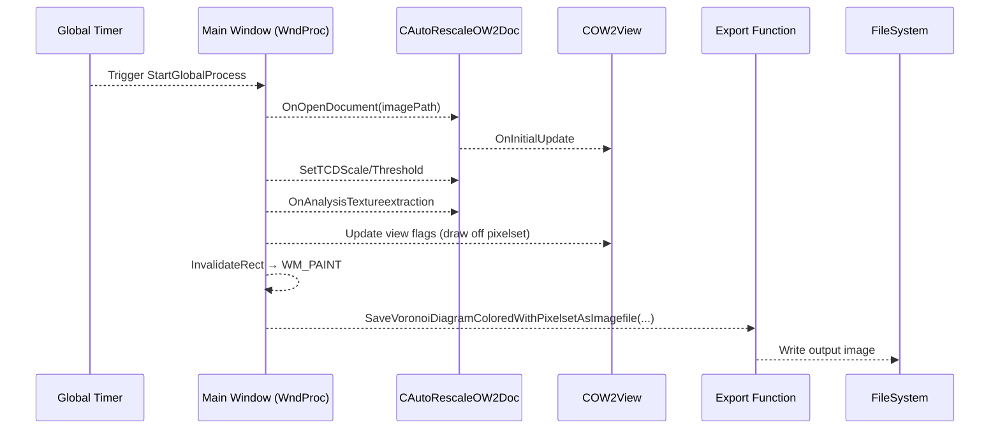

# Core Workflow: Image Loading → Voronoi Render → Save Output

## Overview

The core workflow of spivoronoimidiwin32_vs2017 sequentially processes each input image by:

1. Loading the image into a pixel‐set representation.
2. Computing and rendering a Voronoi diagram over the pixel set.
3. Exporting the rendered result to an image file, with fully configurable fill, background, and color‐mapping options.

This workflow enables users to generate stylized Voronoi‐based visuals—controlling polygon fill percentage, stochastic pixel density, background style (solid color, channel extraction, or random texture), and optional alternate‐texture color mapping—then save each frame for downstream use or animation sequences.

## Workflow Sequence



## Export Functionality

### Invocation Site

In `spivoronoimidiwin32.cpp`, inside the per‐image loop (WM_PAINT handler), the export call is:

```cpp
global_pOW2Doc->SaveVoronoiDiagramColoredWithPixelsetAsImagefile(
    utf8_decode(fullpath).c_str(),
    global_pOW2View,
    global_portionofvoronoipolygonstofill,
    global_inverseprob_onpixelfill,
    global_ibackgroundfill,
    global_ired,
    global_igreen,
    global_iblue,
    global_imagechannel,
    global_pBackgroundColorsOW2Doc,
    global_voronoisetedgesfilterflag,
    global_voronoisetpointsfilterflag,
    global_pAlternateColorsOW2Doc,
    global_voronoisetedgesmapperflag,
    global_voronoisetpointsmapperflag
);
```

### Parameters Passed

| Parameter | Type | Description |
| --- | --- | --- |
| `outputPath` | `LPCTSTR` | Destination file path (constructed as `<outputFolder>\<baseFilename>`). |
| `pView` | `COW2View*` | View context holding rendering settings. |
| `portionOfPolygonsToFill` | `float` | Fraction of each Voronoi polygon eligible for interior fill (0.0–1.0). |
| `inverseProbabilityOnPixelFill` | `int` | Stochastic density: 1 in *N* pixels inside polygons is filled (e.g., 4 → 25% density). |
| `iBackgroundFill` | `int` | Background mode: 0=solid black, 1=solid RGB, 2=image channel, 3=random texture. |
| `iRed, iGreen, iBlue` | `int, int, int` | RGB components (0–255) for solid background when mode=1. |
| `imageChannel` | `int` | Channel index for background when mode=2: 0=all, 1=R, 2=G, 3=B, 4=gray composite. |
| `pBackgroundColorsDoc` | `CAutoRescaleOW2Doc*` | Document loaded from `global_backgroundcolorsimagefolder` supplying random textures. |
| `edgesFilterFlag` | `int` | Bitmask filtering which edge segments to draw based on color categories. |
| `pointsFilterFlag` | `int` | Bitmask filtering which polygon interiors to render based on color categories. |
| `pAlternateColorsDoc` | `CAutoRescaleOW2Doc*` | Document loaded from `global_alternatecolorsimagefolder` for alternate‐texture sampling. |
| `edgesMapperFlag` | `int` | Bitmask enabling color mapping of edges from the alternate texture. |
| `pointsMapperFlag` | `int` | Bitmask enabling color mapping of polygon interiors from the alternate texture. |


## Rendering Options and Their Effects

- **Polygon Interior Fill Percent**

Controls the maximum coverage of colored fills across all Voronoi polygons. A value of `1.0f` allows every polygon interior to be considered; lower values proportionally limit the number of polygons rendered.

- **Stochastic Pixel Fill Density**

With `inverseProbabilityOnPixelFill = N`, roughly one pixel in *N* within each polygon interior is colored, producing a dithered or sparse fill effect (e.g., `4` ⇒ ~25% fill density).

- **Background Selection Modes**
- `0`: Solid black background (legacy Vorotrans style).
- `1`: Solid RGB background using `iRed`, `iGreen`, `iBlue` (each 0–255).
- `2`: Single‐channel extraction from the source image via `imageChannel` (0=all,1=R,2=G,3=B,4=gray).
- `3`: Randomly tiled image from `global_backgroundcolorsimagefolder`, loaded into `global_pBackgroundColorsOW2Doc` and sampled per pixel.

- **Alternate‐Texture Color Mapping**

When `edgesMapperFlag` or `pointsMapperFlag` include any `VORONOISET_COLOR_MAP_*` bits, the corresponding geometric elements (edges or polygon interiors) derive their colors by sampling a random location from the alternate‐texture document (`global_pAlternateColorsOW2Doc`), enabling richly textured line and fill styles.

This export functionality unifies user‐driven aesthetic controls—fill coverage, randomness, background styling, and texture‐based color mapping—into a single API call, ensuring that every saved image reflects the exact combination of parameters set at runtime.