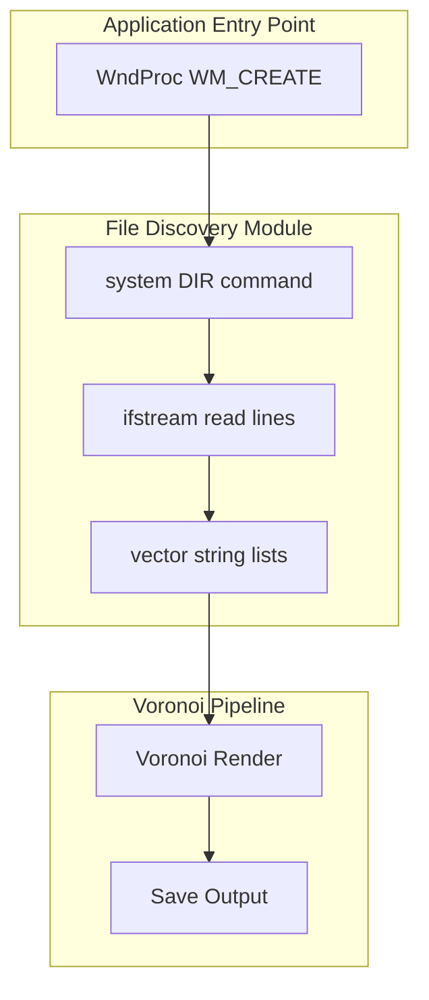
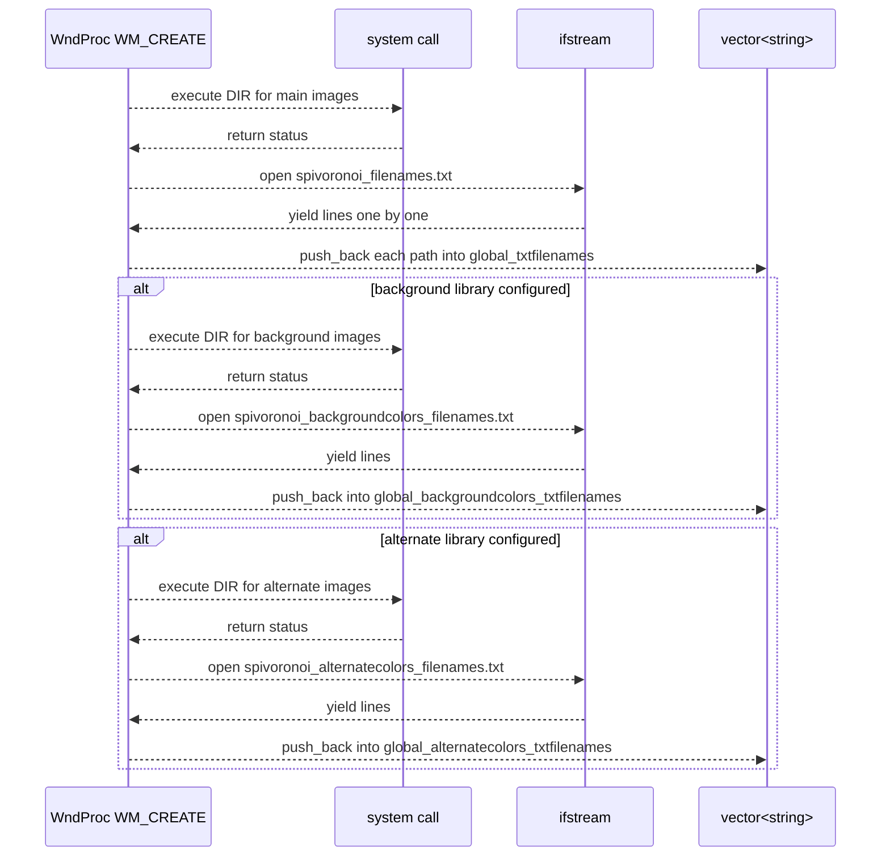

# Core Workflow: Image Loading → Voronoi Render → Save Output Feature Documentation

## Overview

The Core Workflow handles discovery of input images on disk, preparing them for the subsequent Voronoi rendering and output steps. Upon application startup (WM_CREATE), the feature:

- Scans one or more configured folders for image files.
- Generates ordered lists of file paths via Windows `DIR` commands.
- Loads these lists into in-memory vectors for processing.

This automated folder scanning ensures that users can point the application at any directory of JPEG images, and have them rendered in sequence, with optional background or alternate color libraries. By offloading file enumeration to the OS-level `DIR` utility and streaming results via text files, the implementation remains simple, robust, and easily extensible to additional formats.

## Architecture Overview



## Component Structure

### 1. Presentation Layer

#### **WndProc WM_CREATE Handler**

*File: spivoronoimidiwin32.cpp*

- Purpose and responsibilities
- Invoked when the main window is created.
- Executes folder scans for the primary image set, optional background and alternate-color image libraries.
- Populates global vectors driving the processing order.

- Key Global Variables
- `string global_imagefolder` – Path to main image folder (default: `"."`).
- `string global_backgroundcolorsimagefolder` – Path to background-color images (optional).
- `string global_alternatecolorsimagefolder` – Path to alternate-color images (optional).
- `vector<string> global_txtfilenames` – Holds main image file paths.
- `vector<string> global_backgroundcolors_txtfilenames` – Holds background image file paths.
- `vector<string> global_alternatecolors_txtfilenames` – Holds alternate-color image file paths.

- Key Operations
- Set `pathfilter = path + "\\*.jpg"`.
- Build `systemcommand = "DIR " + quote + pathfilter + quote + " /B /S /O:N > <output>.txt"`.
- Call `system(systemcommand.c_str())`.
- Open the generated `<output>.txt` with `ifstream`.
- Read each line into the corresponding `vector<string>` with `getline(ifs, temp)` and `push_back`.

```cpp
// Main image folder scan
path = global_imagefolder;
//pathfilter = path + "\\*.bmp";
pathfilter = path + "\\*.jpg";
systemcommand = "DIR " + quote + pathfilter + quote + "/B /S /O:N > spivoronoi_filenames.txt";
system(systemcommand.c_str());
ifstream ifs("spivoronoi_filenames.txt");
while (getline(ifs, temp)) {
    global_txtfilenames.push_back(temp);
}
```

### 2. Business Layer

#### **File Discovery Module**

*Embedded in spivoronoimidiwin32.cpp WM_CREATE*

- Purpose
- Abstracts the enumeration of `.jpg` files from disk into ordered lists.

- Supported Formats
- JPEG only (`*.jpg`).
- Code shows commented support for BMP (`*.bmp`), but active filter is `*.jpg`.

- Extension Filter
- Main and auxiliary scans all files matching `\\*.jpg` in the target folder.

### 3. Data Access Layer

#### **DIR/List/ifstream Pattern**

*File: spivoronoimidiwin32.cpp*

- Uses the C runtime `system()` call to shell out to Windows `DIR`.
- Reads text output via C++ `ifstream`.
- No direct Windows API folder enumeration—relies on OS command-line utility.

```cpp
// Background-color folder scan
path = global_backgroundcolorsimagefolder;
pathfilter = path + "\\*.jpg";
systemcommand = "DIR " + quote + pathfilter + quote + "/B /S /O:N > spivoronoi_backgroundcolors_filenames.txt";
system(systemcommand.c_str());
ifstream ifs("spivoronoi_backgroundcolors_filenames.txt");
while (getline(ifs, temp)) {
    global_backgroundcolors_txtfilenames.push_back(temp);
}
// Alternate-color folder scan similarly populates global_alternatecolors_txtfilenames
```

## Feature Flows

### 1. Input Discovery Flow



## Error Handling

- The code does not explicitly check for `system()` failure or `ifstream` open errors.
- If a text file is missing or unreadable, the corresponding vector remains empty, leading to an empty processing queue.

## Dependencies

- C++ Standard Library (`<fstream>`, `vector`, `string`).
- C Runtime `system()` function.
- Windows `DIR` command.
- No external HTTP, messaging, or caching services in this feature.

## Testing Considerations

- Verify behavior when a folder contains no `.jpg` files (empty list).
- Test with deeply nested folder structures (the `/S` flag).
- Ensure that paths containing spaces or special characters are correctly quoted.
- Confirm that commented BMP support can be enabled if required by changing the filter.