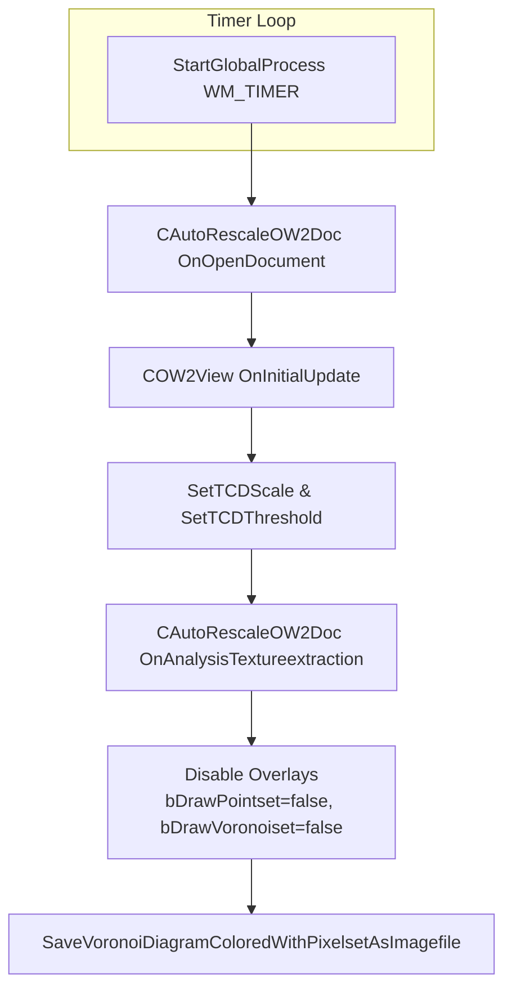
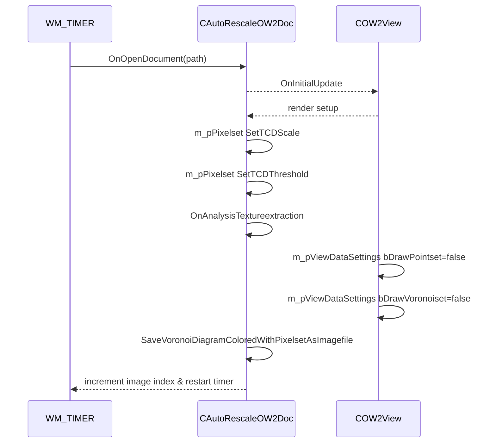

# Core Workflow: Image Loading → Voronoi Render → Save Output

## Overview

The per-image processing pipeline automates the sequence of loading each image file, extracting a point-based texture representation, rendering the corresponding Voronoi diagram, and exporting the result as an image. This workflow runs in response to a timer (WM_TIMER) callback, iterating over all image filenames discovered in the input folder. It ensures each image undergoes consistent analysis and rendering settings before being saved, enabling batch generation of Voronoi-based visuals.

This section details each step in the loop—from opening the document to exporting the final colored Voronoi diagram—highlighting key method calls, view-setting flags, and the export API whose parameters govern background fill, color-mapping rules, and output location.

## Workflow Sequence



## Per-Image Processing Pipeline

### 1. Open Image (OnOpenDocument)

The loop begins by calling

```cpp
global_pOW2Doc->OnOpenDocument(path);
```

to load the image into the document’s pixelset. If this returns `true`, the document and its associated pixel buffer are ready for view initialization and analysis .

### 2. Initialize View (OnInitialUpdate)

Immediately after loading, the view is refreshed:

```cpp
global_pOW2View->OnInitialUpdate();
InvalidateRect(global_hwnd, NULL, false);
```

This sets up the view’s internal state and triggers a repaint of the window .

### 3. Configure Pixelset Analysis (SetTCDScale, SetTCDThreshold)

Before texture extraction, the document’s pixelset analysis parameters are adjusted:

```cpp
if (global_pOW2Doc->m_pPixelset) {
    global_pOW2Doc->m_pPixelset->SetTCDScale(global_TCDScale_inpixel);
    global_pOW2Doc->m_pPixelset->SetTCDThreshold(global_TCDThreshold_inlevel);
}
```

These calls control the scale and threshold for the texture-based point detection algorithm .

### 4. Run Texture Extraction (OnAnalysisTextureextraction)

With parameters in place, the document performs texture extraction to generate a pointset:

```cpp
global_pOW2Doc->OnAnalysisTextureextraction();
```

This builds the triangulation network and computes Voronoi site locations based on the detected texture features .

### 5. Render Flags Adjustment

If the extracted pointset has more than five points, the rendering overlays are disabled to produce a clean Voronoi diagram:

```cpp
if (global_pOW2Doc->GetNumberOfPoint() > 5) {
    global_pOW2View->m_pViewDataSettings->bDrawPointset   = FALSE;
    global_pOW2View->m_pViewDataSettings->bDrawVoronoiset = FALSE;
    InvalidateRect(global_hwnd, NULL, false);
}
```

Disabling `bDrawPointset` and `bDrawVoronoiset` ensures only the filled polygons (and optional backgrounds) appear in the export .

### 6. Export Output (SaveVoronoiDiagramColoredWithPixelsetAsImagefile)

Finally, the document exports the colored Voronoi diagram to an image file:

```cpp
string fullpath = global_vorotransoutputfolder + base_filename;
global_pOW2Doc->SaveVoronoiDiagramColoredWithPixelsetAsImagefile(
    utf8_decode(fullpath).c_str(),
    global_pOW2View,
    global_portionofvoronoipolygonstofill,
    global_inverseprob_onpixelfill,
    global_ibackgroundfill,
    global_ired, global_igreen, global_iblue, global_imagechannel,
    global_pBackgroundColorsOW2Doc, global_voronoisetedgesfilterflag,
    global_voronoisetpointsfilterflag,
    global_pAlternateColorsOW2Doc,
    global_voronoisetedgesmapperflag, global_voronoisetpointsmapperflag
);
```

This method applies the configured fill percentage, inverse-probability pixel fill, background color or channel selection, and optional alternate textures or color-mapping rules when populating each polygon interior .

## WM_TIMER Loop Excerpt

Within the `InitInstance` setup, a one-shot timer is started:

```cpp
global_timer = timeSetEvent(
    100, 25,
    (LPTIMECALLBACK)&StartGlobalProcess,
    0, TIME_ONESHOT
);
```

The `StartGlobalProcess` callback embodies the loop above, incrementing `global_imageid` after each export and re-posting itself via a new timer based on `global_sleeptimepervoronoi_sec` .

## Sequence Diagram



---

This end-to-end pipeline guarantees each image is opened, analyzed for texture-based point extraction, rendered as a Voronoi diagram with precise fill and color rules, and saved to disk automatically.