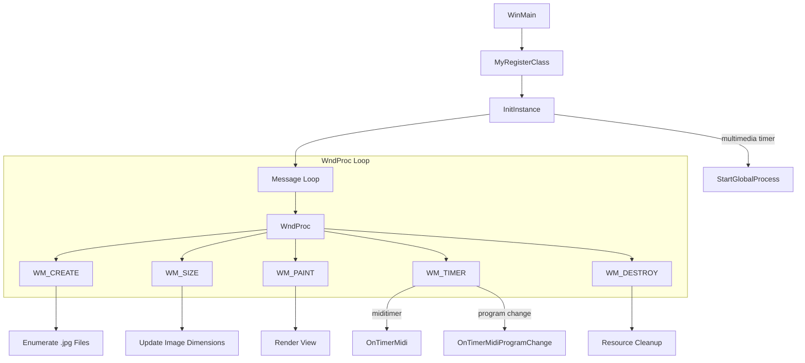

# Internals (for Advanced Users): Project Layout & Main Application Logic

## Overview

This section describes the internal structure of the spivoronoimidiwin32 application, focusing on the core startup, event loop, and timer-based processing implemented in **spivoronoimidiwin32.cpp**. Advanced users will learn how command-line parsing, global configuration, window creation, message dispatching, multimedia and Win32 timers, and MIDI callbacks are organized.

The heart of the application lives in the WinMain/InitInstance registration, the `WndProc` window procedure (handling `WM_CREATE`, `WM_SIZE`, `WM_PAINT`, `WM_TIMER`, and `WM_DESTROY`), a one-shot multimedia timer to drive the image-processing loop, and two Win32 timers for MIDI note and program-change scheduling.

## Architecture Overview



## Component Structure

### spivoronoimidiwin32.cpp

*Core application logic, command-line parsing, window procedure, timers, and MIDI callbacks.*

#### WinMain, Class Registration, and Startup

- **MyRegisterClass** registers the window class, loading icons, cursor, background brush, and optionally attaching a menu if `global_menubardisplay` is set .
- **InitInstance** saves the instance handle (`hInst`), creates the main window in either overlapped or pop-up style based on `global_titlebardisplay`, applies layered transparency (`SetLayeredWindowAttributes`), shows the window, and schedules a one-shot multimedia timer (`timeSetEvent`) to invoke `StartGlobalProcess` .

#### Message Loop

A standard Win32 message pump retrieves and dispatches messages to `WndProc`.

#### WndProc (Window Procedure)

Handles core Windows messages:

- **WM_CREATE**

Executes a `DIR` command to enumerate all `.jpg` files in `global_imagefolder` into `spivoronoi_filenames.txt`, then loads filenames into `global_txtfilenames`. If `global_backgroundcolorsimagefolder` is non-empty, repeats the process for background-color images .

- **WM_SIZE**

Updates `global_imagewidth` and `global_imageheight` from the client rectangle .

- **WM_PAINT**

Begins painting, and if `global_pOW2Doc` and `global_pOW2View` are valid, obtains an MFC `CDC*` and invokes `global_pOW2View->OnDraw(pDC)` to render the current Voronoi visualization .

- **WM_TIMER**

Dispatches two Win32 timers by `wParam`:

- `global_miditimer` → `OnTimerMidi()`
- `global_miditimer_programchange` → `OnTimerMidiProgramChange()` .

- **WM_DESTROY**

Cleans up resources:

- Kills the multimedia timer (`timeKillEvent(global_timer)`).
- Deletes document/view objects (`global_pOW2Doc`, `global_pOW2View`, plus background/alternate docs).
- Clears and deletes any pending `PmEvent*` in `global_pmeventlist`.
- Closes the log file (`pFILE`).
- If `global_bsendmidi` is true, kills the two Win32 timers, sends “all notes off” for channels 0–127, closes and terminates the PortMidi stream (`Pm_Close`, `Pm_Terminate`) .
- Posts `WM_QUIT` to exit the message loop .

#### Timer Usage

- **Multimedia Timer**

Created once in `InitInstance`:

```cpp
  global_timer = timeSetEvent(100, 25, (LPTIMECALLBACK)&StartGlobalProcess, 0, TIME_ONESHOT);
```

Drives the main image-processing loop in `StartGlobalProcess` .

- **Win32 Timers**

Set in `WM_CREATE` after opening the PortMidi output:

```cpp
  SetTimer(hWnd, global_miditimer, global_midistep_ms, NULL);
  SetTimer(hWnd, global_miditimer_programchange, global_midiprogramchangeperiod_ms, NULL);
```

Trigger periodic MIDI note playback and program-change events .

#### MIDI Callback Handlers

- **OnTimerMidi**

Advances `global_prevstep`, then for each `PmEvent*` in `global_pmeventlist[global_prevstep]`, writes events to the MIDI stream (`Pm_Write`) and deletes them. Ensures thread-safe busy flags around each list .

- **OnTimerMidiProgramChange**

Chooses a random program number in [0‒127], forms a Program Change message (`0xC0 | channel`), and sends it via `Pm_Write` .

- **StartGlobalProcess**

A one-shot callback invoked by the multimedia timer. It loops for `global_duration_sec`, recreating and deleting the document/view, randomly selecting images and color overlays, computing Voronoi tessellations, scheduling MIDI events into `global_pmeventlist`, and finally posts `WM_DESTROY` when done .

## Key Source Files Reference

| File | Responsibility |
| --- | --- |
| spivoronoimidiwin32.cpp | Implements WinMain, class registration, InitInstance, WndProc handlers, timers, and MIDI callbacks. |
| spivoronoimidiwin32.h | Declarations of resources and forward declarations for WinMain and WndProc. |
| stdafx.h / stdafx.cpp | Precompiled header setup and inclusion of MFC and Windows headers. |
| resource.h | Defines resource IDs (icons, menus, dialogs). |
