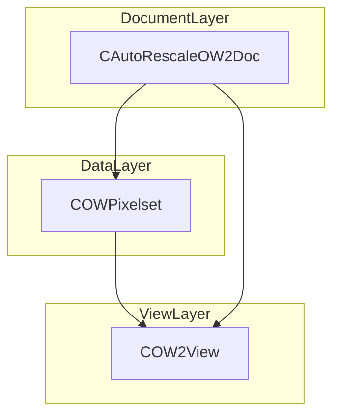
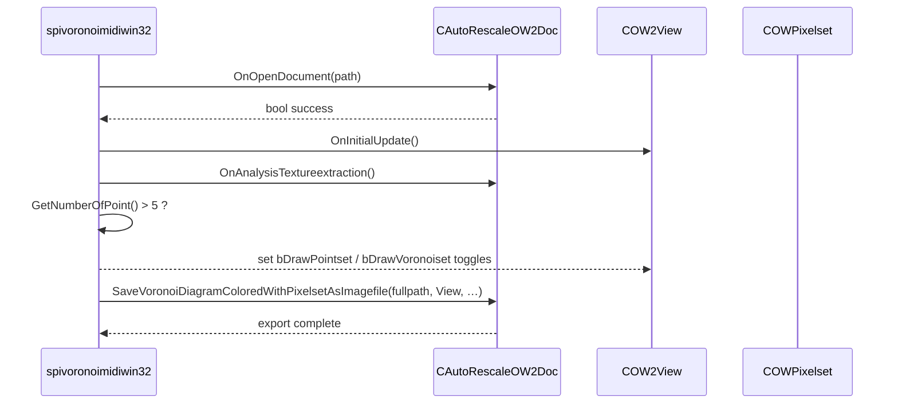

# Voronoi Document/View Integration Feature Documentation

## Overview

The Voronoi Document/View integration encapsulates all Voronoi‐diagram rendering logic within an MFC document class (`CAutoRescaleOW2Doc`) and delegates drawing and user‐configurable rendering toggles to a view class (`COW2View`). This separation of concerns allows advanced users to customize image loading, texture extraction, diagram generation, and export pipelines by extending or replacing document and view components.

Within the application’s main loop, images are loaded into a pixel set, analyzed to extract texture and point sets, and then rendered as filled Voronoi polygons. The view controls whether point sets or edge sets are drawn and can be updated on demand. Finally, the document can export the colored Voronoi diagram to an image file using configurable rules for background fill, color mapping, and polygon‐filling probability.

## Architecture Overview

## Component Structure

### 1. Document Layer

#### CAutoRescaleOW2Doc

*Path: AutoRescaleOw2doc.h / AutoRescaleOw2doc.cpp*

Extends `COW2Doc` to override image loading and hook view settings.

Constructor Dependencies

| Type | Description |
| --- | --- |
| HWND | Parent window handle passed to base `COW2Doc` constructor |

Public Methods

| Method | Description |
| --- | --- |
| CAutoRescaleOW2Doc() | Default constructor (for serialization) |
| CAutoRescaleOW2Doc(HWND) | Constructor binding the document to a window handle |
| ~CAutoRescaleOW2Doc() | Destructor cleans up base resources |
| OpenFileAsPixelset | Loads and rescales an image file into a pixel set |

**Document Methods Invoked by Application**

- OnOpenDocument

Initiates file parsing and pixelset creation.

- OnAnalysisTextureextraction

Performs texture analysis and populates point and edge sets.

- SaveVoronoiDiagramColoredWithPixelsetAsImagefile

Exports the rendered Voronoi diagram to an image file with configured fill/background rules.

- GetNumberOfPoint

Returns the number of points extracted for Voronoi diagram generation.

- GetPointsetObjectStatAsDouble

Retrieves statistical properties (e.g., polygon area, intensity) of a Voronoi cell, used for MIDI mapping.

### 2. View Layer

#### COW2View

*Path: Provided by oifiilib (included via spivoronoimidiwin32.cpp)*

Responsible for rendering the pixel set and Voronoi diagram according to view settings.

Key Methods

| Method | Description |
| --- | --- |
| OnCreate | Initializes view resources |
| OnInitialUpdate | Sets up initial device contexts and metrics |

Settings Toggles

| Setting | Purpose |
| --- | --- |
| bDrawPointset | When TRUE, renders the point set used for Voronoi diagram; toggled after analysis |
| bDrawVoronoiset | When TRUE, renders Voronoi cell edges; toggled after analysis |

## Feature Flows

### Voronoi Rendering and Export Sequence

## Key Classes Reference

| Class | Responsibility |
| --- | --- |
| CAutoRescaleOW2Doc | Loads/rescales images, performs texture extraction, point‐set generation, and exports colored Voronoi diagrams |
| COW2View | Handles rendering of pixel sets and Voronoi diagrams, exposes view‐toggle settings |
