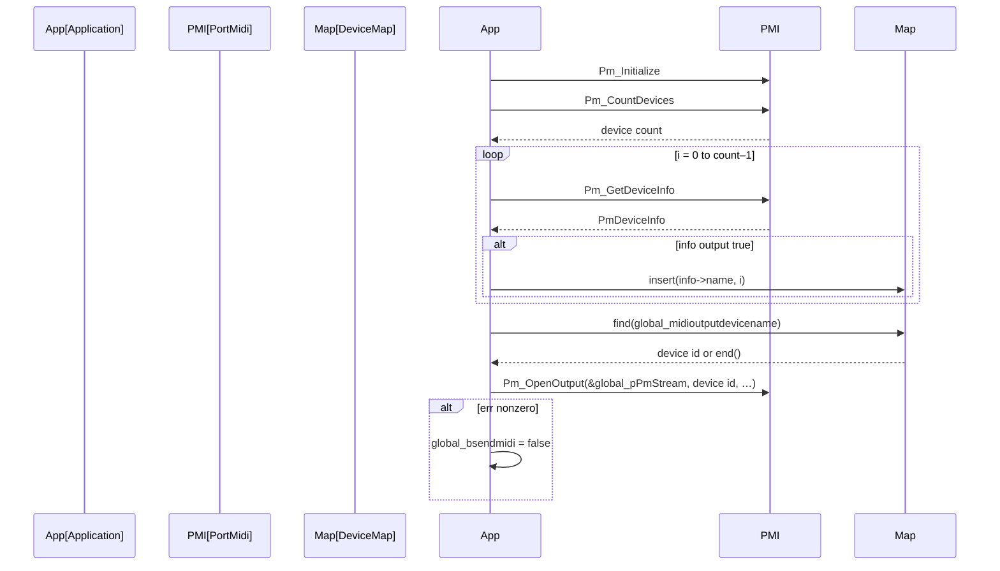

# MIDI Output (Optional): Turning Images into Notes and Program Changes – Enabling MIDI and Selecting an Output Device (PortMidi)

## Overview

The optional MIDI Output feature allows the application to convert Voronoi-diagram statistics derived from each image into MIDI Note On/Off messages and periodic Program Change events. When enabled, the application initializes PortMidi, enumerates available output devices, selects one by name, and opens a MIDI output stream. If any errors occur, MIDI sending is automatically disabled to ensure the application continues rendering visuals without audio output.

## Configuration Globals

| Variable | Type | Default | Description |
| --- | --- | --- | --- |
| global_bsendmidi | bool | false | Master switch for MIDI sending. Must be true to initialize PortMidi. |
| global_midioutputdevicename | string | "loopMIDI Port 1" | Desired PortMidi output device name used to look up its device ID. |
| global_midioutputdevicemap | map<string,int> | empty | Maps each discovered device name to its PortMidi integer ID. |
| global_pPmStream | PmStream* | NULL | Handle to the opened PortMidi output stream. |


## PortMidi Initialization and Device Enumeration

During application startup (inside the WM_CREATE or equivalent initialization block), if `global_bsendmidi` is set to true, the following steps occur:

1. **Initialize PortMidi**

```cpp
   PmError err;
   Pm_Initialize();
```

1. **Enumerate Output Devices**

Loop from `0` to `Pm_CountDevices() – 1`, call `Pm_GetDeviceInfo(i)`, and for each `info->output == true` insert into `global_midioutputdevicemap`.

```cpp
   for (int i = 0; i < Pm_CountDevices(); i++) {
       const PmDeviceInfo* info = Pm_GetDeviceInfo(i);
       if (info->output) {
           global_midioutputdevicemap.insert(pair<string,int>(info->name, i));
       }
   }
```

## Selecting the Output Device by Name

After populating `global_midioutputdevicemap`, the code attempts to find the device ID matching `global_midioutputdevicename`. If found, that ID is used; otherwise a hard-coded fallback (13) remains.

```cpp
int midioutputdeviceid = 13;
auto it = global_midioutputdevicemap.find(global_midioutputdevicename);
if (it != global_midioutputdevicemap.end()) {
    midioutputdeviceid = it->second;
}
```

## Opening the MIDI Output Stream and Error Handling

With `midioutputdeviceid` determined, the application opens the PortMidi stream. Any error returned causes `global_bsendmidi` to be set to false, disabling further MIDI activity.

```cpp
err = Pm_OpenOutput(
    &global_pPmStream,
    midioutputdeviceid,
    NULL,
    512,
    NULL,
    NULL,
    0
);
if (err) {
    // Log error text and disable MIDI
    fprintf(pFILE, "%s\n", Pm_GetErrorText(err));
    global_bsendmidi = false;
}
```

## Sequence Diagram: MIDI Initialization Flow



## Cleanup on Exit

When the application window is destroyed (WM_DESTROY), if `global_bsendmidi` remains true, all active note-offs are sent, the stream is closed, and PortMidi is terminated.

```cpp
if (global_bsendmidi) {
    // Send Note Off for all channels/notes
    for (int k = 0; k < 128; k++) {
        PmEvent evt;
        evt.timestamp = 0;
        evt.message = Pm_Message(0x90 + global_outputmidichannel, k, 0);
        Pm_Write(global_pPmStream, &evt, 1);
    }
    Pm_Close(global_pPmStream);
    Pm_Terminate();
}
```