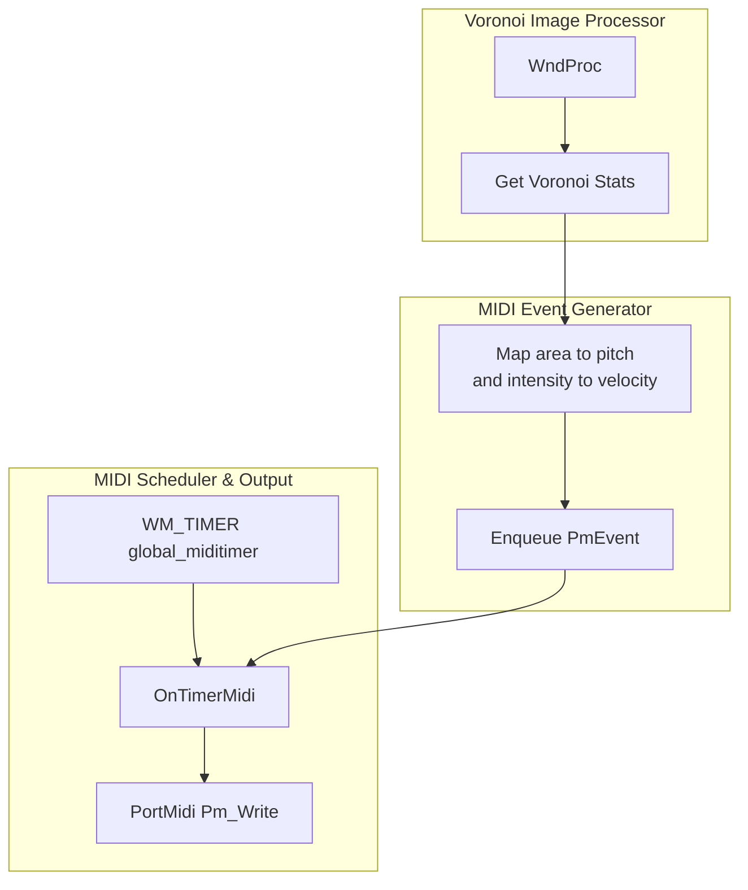

# MIDI Output (Optional): Turning Images into Notes and Program Changes Feature Documentation

## Overview

This feature enables spivoronoimidiwin32 to sonify image‐derived Voronoi statistics by generating MIDI note-on and note-off events. For each rendered image, a subset of Voronoi cells is sampled at random. The area of each cell is mapped to MIDI pitch (0–127), and the intensity statistic is mapped to MIDI velocity (0–127). Note-on events are enqueued immediately, with corresponding note-off events scheduled after a randomized delay slot. A Win32 timer periodically dequeues and sends these events via PortMidi, allowing dynamic, generative musical output synchronized with the visual transformations.

## Architecture Overview



## Component Structure

### Presentation Layer

#### **WndProc** (`spivoronoimidiwin32.cpp`)

- Purpose: Central Windows message handler.
- Responsibilities:
- Handles image loading and rendering.
- After each image render, when `global_bsendmidi` is true, runs the MIDI event generation loop.
- Sets Win32 timers (`WM_TIMER`) for dispatching note events and program changes via `OnTimerMidi` and `OnTimerMidiProgramChange`.

### Business Layer

#### **MIDI Event Generation** (`spivoronoimidiwin32.cpp`)

- Purpose: Sample Voronoi cell statistics and create corresponding MIDI events.
- Process:
- Iterate over `k` from `0` to `global_pmeventlistsize-1`.
- Apply a 25% “trigger” chance:

```cpp
     random_integer = rand() % 4;
     if(random_integer != 1) continue;
```

1. Select a random point‐set object ID in `[0, GetNumberOfPoint()-1]`.
2. Read Voronoi cell area statistic:

```cpp
     double dfVoronoiArea = global_pOW2Doc->GetPointsetObjectStatAsDouble(
       idpointsetobject, POINTSET_OFFSETSTAT_VOROAREA);
     int note = clamp(int(dfVoronoiArea * 127), 0, 127);
```

1. Read intensity statistic:

```cpp
     double dfIntensity = global_pOW2Doc->GetPointsetObjectStatAsDouble(
       idpointsetobject, POINTSET_EXTRA_NUMBEROFSTAT + POINTSET_XYZI_INTENSITY);
     int velocity = clamp(int(dfIntensity * 127), 0, 127);
```

1. Create a note-on `PmEvent` and enqueue it into slot `k`:

```cpp
     PmEvent* pPmEvent = new PmEvent;
     pPmEvent->timestamp = 0;
     pPmEvent->message = Pm_Message(0x90 + global_outputmidichannel,
                                   note, velocity);
     enqueue pPmEvent to global_pmeventlist[k];
```

1. Pick a random delay slot `kk = (k + (1 + rand()%9)) % global_pmeventlistsize`.
2. Create a corresponding note-off `PmEvent` (velocity = 0) and enqueue to `global_pmeventlist[kk]`.
3. Reset `global_miditimerskip` to allow immediate dispatch on the next timer tick.

### MIDI Scheduling & Output

#### **OnTimerMidi** (`spivoronoimidiwin32.cpp`)

- Triggered by `WM_TIMER` with identifier `global_miditimer`.
- Advances `global_prevstep` index cyclically through `[0…global_pmeventlistsize-1]`.
- If not skipped, locks slot `global_prevstep`, then:
- Iterates its `PmEvent*` list, calling:

```cpp
    Pm_Write(global_pPmStream, pPmEvent, 1);
    delete pPmEvent;
```

- Clears the list and unlocks the slot.

## Dependencies

- PortMidi
- Global objects: `PmStream* global_pPmStream`, `PmEvent`.
- Initialization in `WM_CREATE`: `Pm_Initialize()`, `Pm_OpenOutput()`.
- Event dispatch: `Pm_Write(global_pPmStream, &event, 1)`.
- Teardown: `Pm_Close()`, `Pm_Terminate()`.
- Voronoi document interface
- `CAutoRescaleOW2Doc* global_pOW2Doc` exposes `GetPointsetObjectStatAsDouble()` for statistic retrieval.

## Key Classes Reference

| Class / Function | Location | Responsibility |
| --- | --- | --- |
| WndProc | spivoronoimidiwin32.cpp | Main window procedure; drives image processing and MIDI generation |
| MIDI Event Generation Loop | spivoronoimidiwin32.cpp | Maps Voronoi area/intensity to MIDI note-on/off events |
| OnTimerMidi | spivoronoimidiwin32.cpp | Dequeues and sends scheduled MIDI events via PortMidi |
