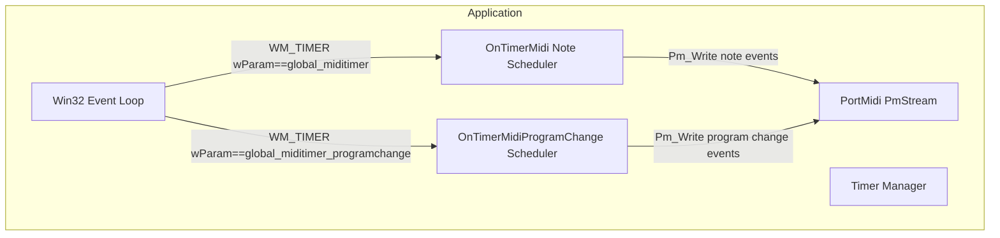
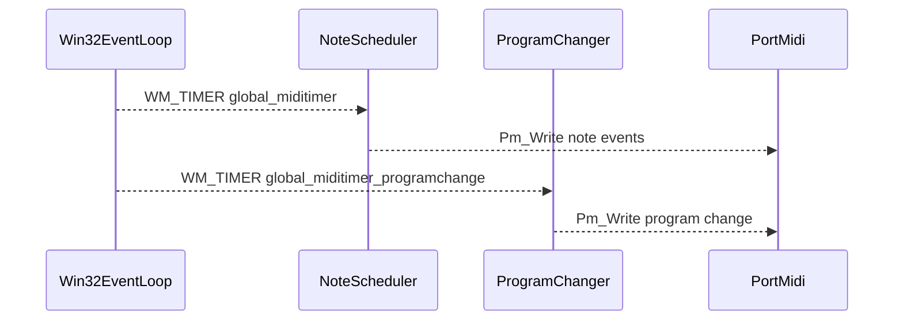

# MIDI Output (Optional): Turning Images into Notes and Program Changes – MIDI Timing Model: Two Timers

## Overview

The MIDI Output feature transforms Voronoi-diagram statistics derived from images into real-time MIDI events. It uses two distinct Windows timers to separate note scheduling from program change events:

- A **short-period step timer** (`global_miditimer`) drives the rhythmic generation and playback of Note On/Off messages based on image-derived statistics.
- A **long-period program change timer** (`global_miditimer_programchange`) injects new instrument patches at a slower, user-configurable interval.

This separation allows fine control over rhythmic density independently from the rate at which the MIDI program (patch) changes, giving users creative flexibility in sonifying image data.

## Architecture Overview



## Component Structure

### Timer Definitions

Defined as globals in **spivoronoimidiwin32.cpp**:

```cpp
UINT global_miditimer = 2;
UINT global_miditimer_programchange = 3;
int global_midistep_ms = 250;
int global_midiprogramchangeperiod_ms = 1000 * 3 * 60;
```

These constants control the IDs and intervals (in milliseconds) for the two timers .

### Timer Setup in spivoronoimidiwin32.cpp

After initializing PortMidi and preparing event lists, the application registers both timers with the main window handle (`hWnd`):

```cpp
SetTimer(hWnd, global_miditimer,
         global_midistep_ms, NULL);
SetTimer(hWnd, global_miditimer_programchange,
         global_midiprogramchangeperiod_ms, NULL);
```

This call instructs Windows to post WM_TIMER messages at the specified intervals .

### Note Timer (`global_miditimer`)

#### Behavior and Scheduling

- Triggered every `global_midistep_ms` milliseconds (default 250 ms → 4 steps/sec).
- Each step increments `global_prevstep`, cycling through `0…global_pmeventlistsize-1`.
- If the step slot is free or skipping is enabled, the scheduler sends all queued `PmEvent*` in `global_pmeventlist[global_prevstep]` to the MIDI stream (`global_pPmStream`) via `Pm_Write`, then deletes them .

### Program Change Timer (`global_miditimer_programchange`)

#### Behavior

- Fires every `global_midiprogramchangeperiod_ms` milliseconds (default 180 000 ms → 3 min).
- Generates a single `PmEvent` with status byte `0xC0+global_outputmidichannel` and a random program number `0…127`.
- Sends the program change immediately via `Pm_Write` .

## User Impact and Configuration

### Rhythm Density

- Controlled by **global_midistep_ms**.
- Lower values → more frequent note playback → denser rhythm.
- Higher values → slower, more sparse musical output.

### Program Change Frequency

- Controlled by **global_midiprogramchangeperiod_ms**.
- Determines how often the instrument patch changes.
- Default of three minutes suits long-form explorations; reduce for rapid timbral shifts.

### Adjusting Timer Values

- Edit the constants at the top of **spivoronoimidiwin32.cpp**:

```cpp
  int global_midistep_ms = /* desired step interval in ms */;
  int global_midiprogramchangeperiod_ms = /* desired program change interval in ms */;
```

- Rebuild the application to apply new timing rules.

## Sequence Diagram: Timer-Driven MIDI Flow



## Key Classes Reference

| Component | Responsibility |
| --- | --- |
| Win32 Event Loop | Dispatch window messages including WM_TIMER |
| OnTimerMidi | Schedule and send Note On/Off events via PortMidi |
| OnTimerMidiProgramChange | Generate and send MIDI program change messages |
| PortMidi (PmStream) | Underlying stream for sending MIDI events |
