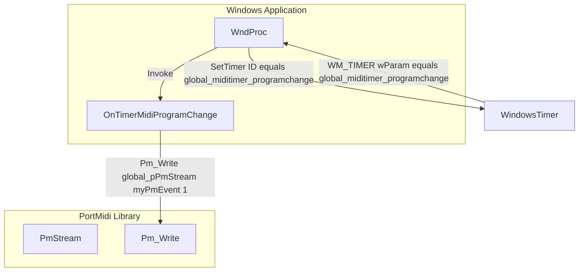
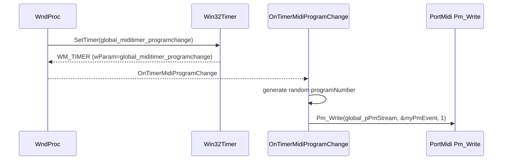

# Program Change Generation (random patches)

## Overview

The Program Change Generation feature periodically sends MIDI Program Change messages to the configured MIDI output device. At each interval, a random program number between 0 and 127 is selected and transmitted on the user-specified MIDI channel. This creates evolving timbral variation—automatically cycling through instrument patches on your soft-synth or hardware module—without manual intervention.

This behavior is optional and controlled by the global `global_bsendmidi` flag. When enabled, the application uses a Windows timer to invoke the `OnTimerMidiProgramChange` callback at a configurable period (`global_midiprogramchangeperiod_ms`). Inside that callback, a new Patch Change message is constructed via PortMidi and dispatched via `Pm_Write`.

## Architecture Overview



## Component Structure

### Global Configuration Variables

These globals control timer behavior and MIDI output parameters:

| Identifier | Type | Description | Default |
| --- | --- | --- | --- |
| global_bsendmidi | bool | Master switch for sending any MIDI messages. | false |
| global_outputmidichannel | int | MIDI channel offset (0 = channel 1). | 0 |
| global_pPmStream | PmStream* | Handle to the opened PortMidi output stream. | NULL |
| global_miditimer_programchange | UINT | Windows timer ID used to schedule program changes. | 3 |
| global_midiprogramchangeperiod_ms | int | Interval between Program Change events, in milliseconds (default = 1000 × 3 × 60 = 180000 ms). | 1000 * 3 * 60 |


### Timer Setup in WndProc (WM_CREATE)

When MIDI output is initialized (after `Pm_OpenOutput` succeeds), two Windows timers are created. The program-change timer uses `global_miditimer_programchange` and fires every `global_midiprogramchangeperiod_ms`.

```cpp
// After successful Pm_OpenOutput(...)
SetTimer(hWnd, global_miditimer, global_midistep_ms, NULL);
SetTimer(hWnd, global_miditimer_programchange, global_midiprogramchangeperiod_ms, NULL);
```

### Timer Dispatch in WndProc (WM_TIMER)

The main window procedure dispatches timer events based on the `wParam` timer ID. When the program-change timer elapses, `OnTimerMidiProgramChange` is invoked.

```cpp
case WM_TIMER:
    if (wParam == global_miditimer_programchange) {
        OnTimerMidiProgramChange();
    }
    return 0;
```

### OnTimerMidiProgramChange

#### Purpose

Handles each Program Change timer event: selects a random patch number (0–127), constructs a MIDI Program Change message on the configured channel, and sends it via PortMidi.

#### Method

| Function | Description |
| --- | --- |
| OnTimerMidiProgramChange | Generate random program number, clamp it to [0,127], build a program change `PmEvent`, and dispatch via `Pm_Write`. |


#### Key Code

```cpp
void OnTimerMidiProgramChange()
{
    if (global_bsendmidi)
    {
        PmEvent myPmEvent;
        int lowest = 0;
        int highest = 128 - 1;
        int range = (highest - lowest) + 1;
        int random_integer = lowest + rand() % range;

        myPmEvent.timestamp = 0;
        int midiprogramnumber = random_integer;
        if (midiprogramnumber >= 128) midiprogramnumber = 127;
        if (midiprogramnumber <= 0)   midiprogramnumber = 0;

        // Construct Program Change: status byte = 0xC0 + channel
        myPmEvent.message = Pm_Message(0xC0 + global_outputmidichannel,
                                       midiprogramnumber,
                                       0x00);

        // Send single event
        Pm_Write(global_pPmStream, &myPmEvent, 1);
    }
}
```

## Data Flow



## Dependencies

- **PortMidi**:
- `Pm_Initialize`, `Pm_OpenOutput`, `Pm_Message`, `Pm_Write`, `Pm_Close`, `Pm_Terminate`.
- Manages the MIDI I/O stream (`global_pPmStream`).
- **Win32 Timer API**:
- `SetTimer`, `WM_TIMER`, `KillTimer`.
- **Standard C Library**:
- `rand()` for random number generation.

## Testing Considerations

- Verify that enabling `global_bsendmidi` causes periodic Program Change messages; disabling it stops them.
- Confirm random patch numbers cover the full 0–127 range in practice.
- Ensure `global_outputmidichannel` correctly offsets the status byte (0xC0–0xCF).
- Observe behavior in your MIDI synth (e.g., loopMIDI Port 1) to validate instrument switching.

## Key Functions Reference

| Function | Responsibility |
| --- | --- |
| OnTimerMidiProgramChange | Generate and send a random MIDI Program Change message on each program-change timer. |
| WndProc (WM_TIMER case) | Dispatch timer events to either note-generation or program-change handlers. |
