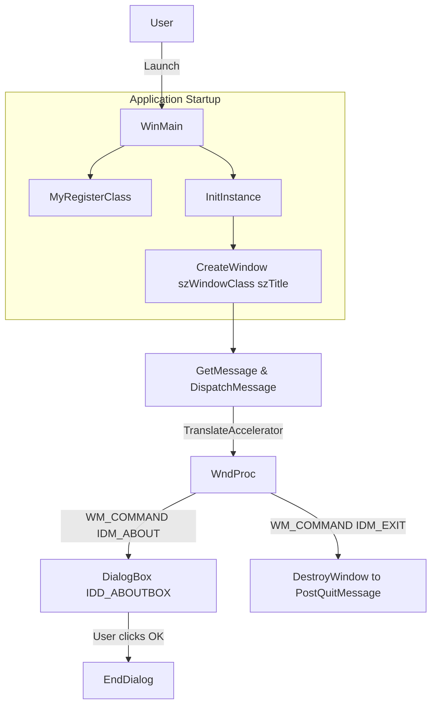
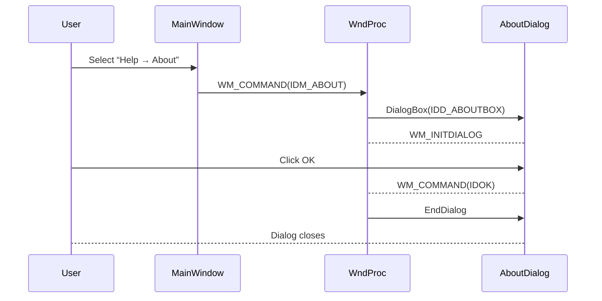

# User Interface Basics (Window, Menu, About Dialog, Accelerators) Feature Documentation

## Overview

The User Interface Basics feature provides the core window creation, menu handling, About dialog, and keyboard accelerator support for the spivoronoimidiwin32 application. On launch, the application registers a Win32 window class that includes the application’s large and small icons, then creates a main window that can optionally be frameless or transparent. A standard File menu (with Exit) and Help menu (with About) is defined in resources and can be toggled on or off via command-line flags. When the user invokes the About command—either via the menu or the Alt+? accelerator—a modal dialog displays application branding, version information, and copyright.

This UI foundation ensures a familiar desktop experience while supporting the application’s unique transparent, frameless window mode. It also lays the groundwork for optional script execution and MIDI integration by providing a stable message loop with accelerator translation and dialog handling.

## Architecture Overview

## Component Structure

### Presentation Layer

#### **MyRegisterClass** (`spivoronoimidiwin32.cpp`)

- Purpose: Registers the main window class with Win32, loading icons and optional menu.
- Key Actions:
- Loads large icon via `LoadIcon(hInstance, MAKEINTRESOURCE(IDI_SPIVORONOIMIDIWIN32))`.
- Loads small icon via `LoadIcon(hInstance, MAKEINTRESOURCE(IDI_SMALL))`.
- Sets `lpszMenuName` to `IDC_SPIVORONOIMIDIWIN32` if `global_menubardisplay` is `1`, otherwise omits the menu.

#### **InitInstance** (`spivoronoimidiwin32.cpp`)

- Purpose: Creates and shows the main application window.
- Key Actions:
- Chooses `WS_OVERLAPPEDWINDOW` or `WS_POPUP | WS_VISIBLE` based on `global_titlebardisplay`.
- Applies layered alpha transparency with `SetLayeredWindowAttributes`.
- Shows the window via `ShowWindow` and `UpdateWindow`.

#### **WndProc** (`spivoronoimidiwin32.cpp`)

- Purpose: Processes window messages.
- Key Message Handling:
- `WM_CREATE`: Initializes file listing and timers.
- `WM_SIZE`: Updates `global_imagewidth`/`height`.
- `WM_COMMAND`:
- `IDM_ABOUT` → `DialogBox(hInst, MAKEINTRESOURCE(IDD_ABOUTBOX), hWnd, About)`.
- `IDM_EXIT` → `DestroyWindow(hWnd)`.
- `WM_PAINT`: Delegates to `global_pOW2View->OnDraw`.
- `WM_TIMER`: Dispatches to `OnTimerMidi` and `OnTimerMidiProgramChange`.
- `WM_DESTROY`: Cleans up timers, documents, MIDI, and posts `PostQuitMessage`.

#### **About Dialog Callback** (`spivoronoimidiwin32.cpp`)

- Signature: `INT_PTR CALLBACK About(HWND hDlg, UINT message, WPARAM wParam, LPARAM lParam)`
- Purpose: Handles the About dialog’s messages.
- Key Handling:
- `WM_INITDIALOG`: Returns `TRUE` to initialize dialog.
- `WM_COMMAND`: On `IDOK` or `IDCANCEL`, calls `EndDialog(hDlg, wParam)`.

### Resources

#### **spivoronoimidiwin32.rc**

*Defines icons, menu, accelerators, About dialog, and string table.*

- **Icon Resources**
- `IDI_SPIVORONOIMIDIWIN32` → `"voronoi_32x32.ico"`
- `IDI_SMALL` → `"voronoi_16x16.ico"`

- **Menu Resource** (`IDC_SPIVORONOIMIDIWIN32`)
- Popup “&File”
- `E&xit` → `IDM_EXIT`
- Popup “&Help”
- `&About .` → `IDM_ABOUT`

- **Accelerator Resource** (`IDC_SPIVORONOIMIDIWIN32`)
- `ALT + ?` → `IDM_ABOUT`
- `ALT + /` → `IDM_ABOUT`

- **About Dialog** (`IDD_ABOUTBOX`)
- Title: **About spivoronoimidiwin32**
- Controls:
- `ICON` control using `IDR_MAINFRAME` at (14, 14).
- Static text “spivoronoimidiwin32, Version 1.0” at (42, 14).
- Static text “Copyright (C) 2014” at (42, 26).
- Default push button “OK” → `IDOK`.

- **String Table**
- `IDC_SPIVORONOIMIDIWIN32` → `"SPIVORONOIMIDIWIN32"`
- `IDS_APP_TITLE` → `"spivoronoimidiwin32"`

#### **Resource.h**

*Defines numeric IDs for resources.*

| Identifier | Value |
| --- | --- |
| `IDS_APP_TITLE` | 103 |
| `IDR_MAINFRAME` | 128 |
| `IDD_SPIVORONOIMIDIWIN32_DIALOG` | 102 |
| `IDD_ABOUTBOX` | 103 |
| `IDM_ABOUT` | 104 |
| `IDM_EXIT` | 105 |
| `IDI_SPIVORONOIMIDIWIN32` | 107 |
| `IDI_SMALL` | 108 |
| `IDC_SPIVORONOIMIDIWIN32` | 109 |
| `IDC_MYICON` | 2 |

## Feature Flows

### About Dialog Flow

## Key Classes Reference

| Function | Location | Responsibility |
| --- | --- | --- |
| MyRegisterClass | spivoronoimidiwin32.cpp | Registers window class, loads icons and optional menu |
| InitInstance | spivoronoimidiwin32.cpp | Creates and displays main window with transparency support |
| WndProc | spivoronoimidiwin32.cpp | Handles window messages (paint, command, timer, destroy) |
| About (Dialog Callback) | spivoronoimidiwin32.cpp | Processes About dialog initialization and button actions |
| Resource Definitions | spivoronoimidiwin32.rc,Resource.h | Defines icons, menus, accelerators, dialogs, and strings |
