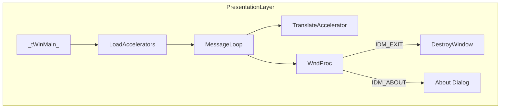
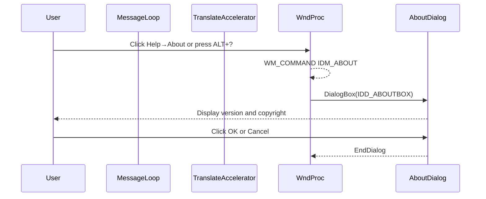
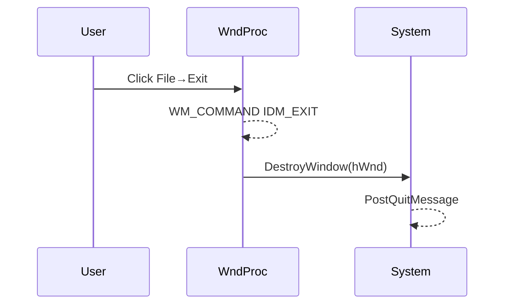

# User Interface Basics – Menu Commands and Keyboard Accelerators

## Overview

This feature provides the core application window, its standard File and Help menus, and keyboard shortcuts for quick access to the About dialog. When the application starts, it creates the main window—either with a standard title bar or as a frameless layered window depending on user settings—and installs an accelerator table so that pressing ALT+? or ALT+/ opens the About box. Selecting File→Exit closes the application, and Help→About displays version and copyright information.

These UI basics form the foundation of user interaction, offering familiar Windows conventions (menus and dialogs) while accommodating configurable window decorations and optional accelerator support. Consistency with Win32/MFC patterns ensures a low barrier for users accustomed to desktop applications.

## Architecture Overview



## Component Structure

###  (spivoronoimidiwin32.cpp)

- **Purpose**

Entry point that parses command-line options, registers the window class, loads the accelerator table if enabled, and runs the main message loop.

- **Key Methods**

• `LoadAccelerators` – loads `IDC_SPIVORONOIMIDIWIN32` accel table when `global_acceleratoractive` is nonzero

• `TranslateAccelerator` – intercepts key messages for the accelerator table

• `DispatchMessage` – delivers messages to `WndProc`

###  (spivoronoimidiwin32.cpp)

- **Purpose**

Defines and registers the window class, attaching `WndProc`, icons, cursor, background brush, and optionally the menu resource based on `global_menubardisplay` .

###  (spivoronoimidiwin32.cpp)

- **Purpose**

Creates the main window with either `WS_OVERLAPPEDWINDOW` (title bar) or `WS_POPUP` (frameless), applies layered transparency, and starts a one-shot timer to initiate processing .

###  (spivoronoimidiwin32.cpp)

- **Purpose**

Handles window messages. Specifically:

• `WM_COMMAND` – routes menu and accelerator commands

• `WM_PAINT` – redraws visuals

• `WM_DESTROY` – cleans up and posts quit

###  Dialog Callback (spivoronoimidiwin32.cpp)

- **Purpose**

Message handler for the About box. Responds to `WM_INITDIALOG` and closes on OK or Cancel .

## Resource Definitions

### Resource IDs (resource.h)

| Identifier | Value |
| --- | --- |
| `IDM_ABOUT` | 104 |
| `IDM_EXIT` | 105 |


### Menu & Accelerator Script (spivoronoimidiwin32.rc)

```rc
// File menu
POPUP "&File"
BEGIN
    MENUITEM "E&xit", IDM_EXIT
END
// Help menu
POPUP "&Help"
BEGIN
    MENUITEM "&About .", IDM_ABOUT
END

// Accelerators
IDC_SPIVORONOIMIDIWIN32 ACCELERATORS
BEGIN
    "?", IDM_ABOUT, ASCII, ALT
    "/", IDM_ABOUT, ASCII, ALT
END
```

All menu and accelerator definitions are under the `IDC_SPIVORONOIMIDIWIN32` resource .

## Menu Commands

| Command | Menu Path | Resource ID | Action |
| --- | --- | --- | --- |
| Exit | File → Exit | `IDM_EXIT` | Destroys main window and quits |
| About | Help → About | `IDM_ABOUT` | Opens modal About dialog |


## Keyboard Accelerators

| Shortcut | Action | Resource ID |
| --- | --- | --- |
| ALT + `?` | About dialog | `IDM_ABOUT` |
| ALT + `/` | About dialog | `IDM_ABOUT` |


 Accelerators are active only when `global_acceleratoractive` is true .

## Feature Flows

### About Dialog Flow



### Exit Flow



## Key Classes Reference

| Component | Responsibility |
| --- | --- |
| `_tWinMain` | Application entry, accelerator setup, message loop |
| `MyRegisterClass` | Registers window class and attaches menu |
| `InitInstance` | Creates the main window and configures visuals |
| `WndProc` | Processes WM_COMMAND for Exit and About |
| `About` | Handles About dialog messages |
