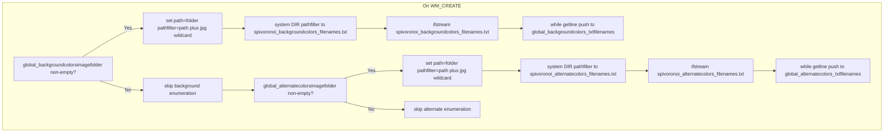

# Using the App: Command-Line Reference

## Background and Alternate Color Image Libraries (folders, file enumeration, formats)

This feature lets you supply two optional image‐library folders—one for background textures and one for “alternate” color textures—that the app will enumerate and randomly sample at runtime. You control these via specific command-line parameters. Under the hood, the app shells out to Windows DIR to list all `*.jpg` files (recursively, sorted by name) into text files, then reads those files into global filename arrays for use in rendering.

---

### Command-Line Parameters

| Position | Parameter | Type | Default Value | Description |
| --- | --- | --- | --- | --- |
| 24 | **backgroundcolorsimagefolder** | string | `D:\claudepicher(12000x12000)(set6)\` | Path to a folder of background color images. Must end with a backslash (`\`). A random image is chosen when `ibackgroundfill == 3`. |
| 27 | **alternatecolorsimagefolder** | string | `D:\claudepicher(12000x12000)(set11)\` | Path to a folder of alternate color images. Must end with a backslash (`\`). Sampled when color‐mapping flags are set. |


---

### Folder Requirements

- Paths **must** end with `\` so that `"path\*.jpg"` correctly expands.
- Each folder may contain one or many JPEG images; images should be at least as large as the main content image.
- Only files matching `*.jpg` are enumerated (BMP support was commented out).

---

### File Enumeration Workflow



1. **Background enumeration**

```cpp
   if (!global_backgroundcolorsimagefolder.empty()) {
       path = global_backgroundcolorsimagefolder;
       pathfilter = path + "\\*.jpg";
       systemcommand = "DIR " + quote + pathfilter + quote +
                       "/B /S /O:N > spivoronoi_backgroundcolors_filenames.txt";
       system(systemcommand.c_str());
       ifstream ifs("spivoronoi_backgroundcolors_filenames.txt");
       while (getline(ifs, temp))
           global_backgroundcolors_txtfilenames.push_back(temp);
   }
```

1. **Alternate enumeration**

```cpp
   if (!global_alternatecolorsimagefolder.empty()) {
       path = global_alternatecolorsimagefolder;
       pathfilter = path + "\\*.jpg";
       systemcommand = "DIR " + quote + pathfilter + quote +
                       "/B /S /O:N > spivoronoi_alternatecolors_filenames.txt";
       system(systemcommand.c_str());
       ifstream ifs("spivoronoi_alternatecolors_filenames.txt");
       while (getline(ifs, temp))
           global_alternatecolors_txtfilenames.push_back(temp);
   }
```

---

### Enumeration File Examples

- **spivoronoi_backgroundcolors_filenames.txt**

```plaintext
  D:\politics(12000x12000)(set2-aoc)\frame_000014.jpg
  D:\politics(12000x12000)(set2-aoc)\frame_000015.jpg
  ...
```

- **spivoronoi_alternatecolors_filenames.txt**

```plaintext
  D:\video\genetic(12000x12000)(set1)\frame_000002.jpg
  D:\video\genetic(12000x12000)(set1)\frame_000006.jpg
  ...
```

---

### Runtime Selection

Once the filename vectors are populated, the app picks a random entry each iteration:

```cpp
auto distBg = uniform_int_distribution<size_t>(
    0, global_backgroundcolors_txtfilenames.size() - 1);
size_t bgId = distBg(global_rd);
string bgPath = global_backgroundcolors_txtfilenames[bgId];
global_pBackgroundColorsOW2Doc->OnOpenDocument(
    utf8_decode(bgPath).c_str());
```

Similarly for alternate colors with `alternatecolorsimagefolder_dist`.

---

### How These Libraries Are Used

- **Background library**: when `ibackgroundfill == 3`, a random texture from the background folder is drawn behind the Voronoi diagram.
- **Alternate library**: when either `voronoisetedgesmapperflag` or `voronoisetpointsmapperflag` is non-zero, a random image from the alternate folder provides custom color mapping.

All loading happens via `CAutoRescaleOW2Doc::OnOpenDocument`, decoding UTF-8 paths and rescaling images to fit the rendering context.