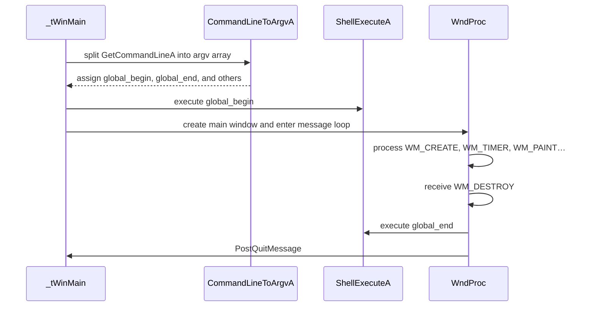

# Using the App: Command-Line Reference

## Overview

The application accepts a sequence of positional command-line arguments to configure image folder, timing, window geometry, rendering options—and, importantly for automation, the filenames of “begin” and “end” scripts. These scripts (AutoHotkey or any executable) are launched automatically at startup and shutdown, enabling users to set up or tear down external system state (for example, power profiles, MIDI routing, window placement) without manual intervention.

By passing `global_begin` and `global_end`, you can orchestrate external tasks—such as launching a loopMIDI port, resetting MIDI channels, repositioning or styling the application window, or starting custom logging—before the main Voronoi rendering loop begins and after it completes. This fits into the overall workflow by providing hooks for environment preparation and cleanup while the app runs its visual and MIDI-generation cycle.

## Architecture Overview



## Component Structure

### Command-Line Parameters Table

| Position | Parameter | Variable | Default | Description |
| --- | --- | --- | --- | --- |
| 1 | Image folder | global_imagefolder | `"."` | Folder containing source images |
| 2 | Total run duration | global_duration_sec | `3600.0` | Seconds before automatic shutdown if ≥ 0 |
| 3 | Sleep per frame (sec) | global_sleeptimepervoronoi_sec | `5.0` | Seconds between each Voronoi render |
| … | … | … | … | … |
| 14 | Begin script filename | global_begin | `"begin.ahk"` | Path to automation script launched at startup |
| 15 | End script filename | global_end | `"end.ahk"` | Path to automation script launched at shutdown |
| 16+ | Additional options… | … | … | See full list in source |


### Variable Definitions

| Variable | Type | Default | Description |
| --- | --- | --- | --- |
| global_begin | string | `"begin.ahk"` | Filename of startup automation script |
| global_end | string | `"end.ahk"` | Filename of shutdown automation script |


These globals are declared at the top of **spivoronoimidiwin32.cpp**  and control which scripts are executed.

### Parsing Logic

The application entrypoint invokes a custom `CommandLineToArgvA` to split the raw command line into an `argv`-style array. Positional arguments beyond index 14 and 15 override the defaults for `global_begin` and `global_end`:

```cpp
if(nArgs > 14) {
    global_begin = szArgList[14];
}
if(nArgs > 15) {
    global_end = szArgList[15];
}
```

(Excerpt from **_tWinMain** in spivoronoimidiwin32.cpp) .

### Script Execution Points

1. **Startup Automation**

Immediately after seeding the RNG and before registering the window class, the code may invoke:

```cpp
   ShellExecuteA(NULL, "open", global_begin.c_str(), "", NULL, nCmdShow);
```

(Commented out by default; enable by removing the `//`) .

1. **Shutdown Automation**

In the `WM_DESTROY` handler (just before `PostQuitMessage`), the code may invoke:

```cpp
   ShellExecuteA(NULL, "open", global_end.c_str(), "", NULL, 0);
```

(Also commented out by default) .

## Typical Use Cases

- **System State Preparation**: Launch an AHK script to switch Windows to high-performance power mode or disable screen savers before long visual runs.
- **MIDI Routing Setup**: Automatically start or configure a virtual MIDI loopback (e.g., loopMIDI), set initial program changes or controller resets.
- **Window Management**: Reposition, resize, or restyle the frameless window using AHK (e.g., move to secondary monitor, toggle always-on-top).
- **Logging and Cleanup**: Begin logging system metrics at startup and flush logs at shutdown, or close auxiliary applications when rendering ends.

## Key Functions Reference

| Function | Location | Responsibility |
| --- | --- | --- |
| CommandLineToArgvA | spivoronoimidiwin32.cpp | Split raw command line into `argv` array |
| _tWinMain | spivoronoimidiwin32.cpp | Entry point: parse args, launch `global_begin`, initialize window |
| WndProc | spivoronoimidiwin32.cpp | Handle window messages; launch `global_end` on destroy |


---

This section covers how to pass and execute startup/shutdown automation scripts via the command line, where to find and modify the related code in **spivoronoimidiwin32.cpp**, and suggestions for using these hooks to integrate external workflows seamlessly with the Voronoi-MIDI application.