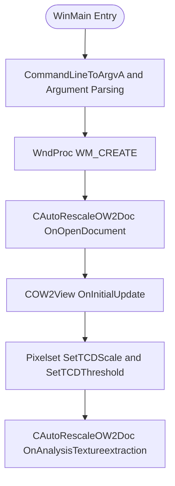

# Using the App: Command-Line Reference (All Parameters)

## Tree Crown Detection Tuning (TCD scale and threshold) Feature Documentation

## Overview

The Tree Crown Detection (TCD) tuning parameters let users control how the application locates local intensity maxima—interpreted as “tree crowns”—in each image.

- **TCD Scale** defines the width, in pixels, of the square convolution kernel used to detect local maxima. Higher-resolution images typically require larger (and odd-sized) kernels (e.g. 3, 5, 7 … 31).
- **TCD Threshold** sets the minimum intensity (0–255) below which maxima are ignored. This prevents noise or low-contrast regions from producing spurious detections.

These parameters are read from the command line (argv indices 30–31), stored in global variables, then applied immediately after image load and before analysis by invoking

```cpp
m_pPixelset->SetTCDScale(global_TCDScale_inpixel);
m_pPixelset->SetTCDThreshold(global_TCDThreshold_inlevel);
```

on the document’s `m_pPixelset` instance.

## Architecture Overview



## Component Structure

### 1. Command-Line Parsing

#### CommandLineToArgvA & argc/argv (`spivoronoimidiwin32.cpp`)

- **Purpose:** Split the raw command line into `szArgList[]` and set global variables.
- **Key Globals:**
- `int global_TCDScale_inpixel`
- `int global_TCDThreshold_inlevel`
- **Behavior:**

```cpp
  if (nArgs > 30)
      global_TCDScale_inpixel = atoi(szArgList[30]);   // tree crown detection kernel width in pixels
  if (nArgs > 31)
      global_TCDThreshold_inlevel = atoi(szArgList[31]); // intensity threshold 0–255
```

### 2. Tree Crown Detection Parameters

| Arg Index | Variable | Type | Description |
| --- | --- | --- | --- |
| 30 | `global_TCDScale_inpixel` | int | Width in pixels of the square convolution kernel. Should be odd (3, 5, 7 … 31). |
| 31 | `global_TCDThreshold_inlevel` | int | Minimum intensity (0–255) for local maxima to qualify as tree crowns (e.g. 80). |


### 3. Pixelset Configuration

#### COWPixelset TCD Methods

- **Invoked In:** `spivoronoimidiwin32.cpp`, immediately before analysis
- **Calls:**

```cpp
  global_pOW2Doc->m_pPixelset->SetTCDScale(global_TCDScale_inpixel);
  global_pOW2Doc->m_pPixelset->SetTCDThreshold(global_TCDThreshold_inlevel);
```

## Feature Flow

> These methods configure the pixelset’s internal parameters so that when `OnAnalysisTextureextraction` runs, only local maxima separated by at least the specified scale and above the threshold are extracted for Voronoi point generation.

1. **Startup**
2. `WinMain` calls `CommandLineToArgvA`, populating `szArgList` and `nArgs`.
3. **Argument Extraction**
4. Indices 1–29 set other settings (folders, colors, MIDI, etc.).
5. Indices 30–31 set TCD scale and threshold.
6. **Window Creation**
7. `WndProc` on `WM_CREATE` loads filenames, selects next image, constructs `CAutoRescaleOW2Doc` and `COW2View`.
8. **Document Open & Initial Update**
9. `OnOpenDocument` loads the image into a `COWPixelset`.
10. `OnInitialUpdate` readies the view.
11. **TCD Configuration**
12. The application calls `SetTCDScale` and `SetTCDThreshold` on the loaded pixelset.
13. **Analysis**
14. `OnAnalysisTextureextraction` processes the image, detecting points only where local intensity maxima meet the configured TCD parameters.

## Key Classes Reference

| Class | Responsibility |
| --- | --- |
| `spivoronoimidiwin32.cpp` | Entry point, command-line parsing, main window procedure, image loop and dispatch |
| `CAutoRescaleOW2Doc` | Subclass of `COW2Doc` that loads and resizes images, exposing `m_pPixelset` |
| `COWPixelset` | Manages image data buffers and provides `SetTCDScale`/`SetTCDThreshold` for tree crown detection tuning |


> **Note:** No external infrastructure services (message buses, caching layers, WebSockets, etc.) are injected by or used within this TCD feature.