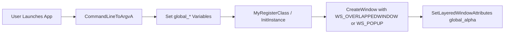

# Using the App: Command-Line Reference

Window Behavior and Timing Controls

## Overview

The spivoronoimidiwin32 application can be fully driven by command-line arguments that control:

- How long the app runs (`duration`) and how long it sleeps between each Voronoi diagram render (`sleep`).
- The position and size of the transparent, frameless window (`x`, `y`, `width`, `height`).
- The window’s overall transparency level (`alpha`).
- Whether the title bar, menu bar, and keyboard accelerators are enabled (`titlebar`, `menubar`, `accelerator`).

These parameters let you embed the app in automation pipelines, projection setups, or headless systems, with no GUI prompts and precise timing control.

## Usage Syntax

```plaintext
spivoronoimidiwin32.exe 
  [<image_folder>] 
  [<duration_sec>] 
  [<sleep_sec>] 
  [<x>] [<y>] 
  [<width>] [<height>] 
  [<alpha>] 
  [<titlebar>] 
  [<menubar>] 
  [<accelerator>]
```

- All parameters are positional.
- Omitting an argument uses its hard-coded default.
- String-valued parameters (not in this section) follow afterward.

## Parameter Reference

| Position | Parameter | Type | Description | Default |
| --- | --- | --- | --- | --- |
| 1 | image_folder | string | Path to the folder containing source images (e.g., `.jpg`). | `.` |
| 2 | duration_sec | float | Total run time in seconds. App exits once this many seconds have elapsed since launch. | 3600 |
| 3 | sleep_sec | float | Delay between rendering each Voronoi diagram, in seconds. | 5 |
| 4 | x | int | X-coordinate (pixels) of the top-left corner of the window. | 100 |
| 5 | y | int | Y-coordinate (pixels) of the top-left corner of the window. | 100 |
| 6 | width | int | Width (pixels) of the window. | 300 |
| 7 | height | int | Height (pixels) of the window. | 300 |
| 8 | alpha | byte | Window transparency (0=fully transparent … 255=fully opaque). | 255 |
| 9 | titlebar | int | Show title bar (1) or hide it (0). | 1 |
| 10 | menubar | int | Show menu bar (1) or hide it (0). | 0 |
| 11 | accelerator | int | Enable keyboard accelerators (1) or disable (0). | 0 |


*Defaults are defined in* `spivoronoimidiwin32.cpp` .

## Example Invocations

- Run for 2 hours, centered at (200,150), size 800×600, semi-transparent, no UI chrome:

```plaintext
  spivoronoimidiwin32.exe . 7200 5 200 150 800 600 128 0 0 0
```

- Use default folder but custom duration and sleep:

```plaintext
  spivoronoimidiwin32.exe . 1800 1
```

## Implementation Details

### Command-Line Parsing

1. The WinMain entry calls `CommandLineToArgvA` to split the command line into `argv[]` and `argc` .
2. For each positional argument beyond `argv[0]`, the code tests `nArgs>i` and then assigns:

```cpp
   global_duration_sec        = atof(argv[2]);
   global_sleeptimepervoronoi_sec = atof(argv[3]);
   global_x                   = atoi(argv[4]);
   global_y                   = atoi(argv[5]);
   global_xwidth              = atoi(argv[6]);
   global_yheight             = atoi(argv[7]);
   global_alpha               = atoi(argv[8]);
   global_titlebardisplay     = atoi(argv[9]);
   global_menubardisplay      = atoi(argv[10]);
   global_acceleratoractive   = atoi(argv[11]);
```

1. Missing arguments leave the globals at their default values.

### Window Creation and Styling

After parsing, `InitInstance` uses these globals to construct the main window:

```cpp
if(global_titlebardisplay) {
  CreateWindow(
    szWindowClass, szTitle,
    WS_OVERLAPPEDWINDOW,
    global_x, global_y,
    global_xwidth, global_yheight,
    …);
}
else {
  CreateWindow(
    szWindowClass, szTitle,
    WS_POPUP | WS_VISIBLE,
    global_x, global_y,
    global_xwidth, global_yheight,
    …);
}
SetLayeredWindowAttributes(global_hwnd, 0, global_alpha, LWA_ALPHA);
```

This yields a frameless, transparent window when `titlebar=0`, with alpha blending set by `global_alpha`.



## Key Classes Reference

| Component | Location | Responsibility |
| --- | --- | --- |
| spivoronoimidiwin32.cpp | `/spivoronoimidiwin32.cpp` | Parses CLI arguments, sets runtime and window control globals; initializes and styles the main window. |
